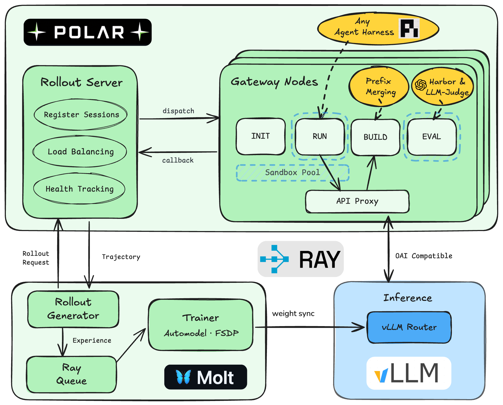

# Linex (wip)

Linex is the all-in-one infra for Agentic RL - training, inference, rollout, sandbox layers combined without glue.
Linex is implemented with minimalism - optimized interface, boilerplate-free, light dependency, and one-piece philosophy (deprecated recipe and model supports are dynamically dropped).

It's a power fork from [Molt](https://github.com/NVIDIA-NeMo/labs-molt) (Pytorch FSDP + glue-free Trainer) and [Polar](https://github.com/NVIDIA-NeMo/ProRL-Agent-Server) (efficient containerized agent rollout). Friendly for researchers and hackers to fork-and-build from.

<p align="center">
  
</p>

## Install

Linex requires Python 3.11 or newer:

```bash
python3 -m pip install -e .
```

## Recipes

[Skill2Env RL DPPO](examples/skill2env_rl_dppo/README.md): asynchronous DPPO training with [skill2env](https://github.com/NVlabs/Skill2Env/tree/main) dataset.
